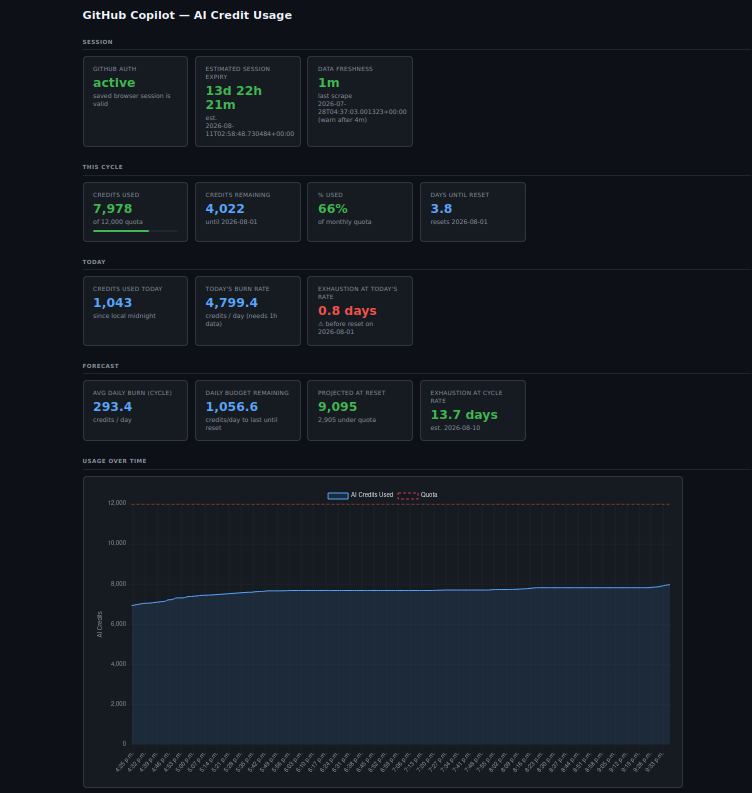

# gh-scraper

Lightweight Python tool that scrapes your GitHub Copilot usage stats and stores them in a local SQLite database.


---

## Running with Docker

### 1. Configure (optional)

```bash
cp .env.example .env
# Edit .env to set HOST_PORT, DATA_DIR, SCAN_INTERVAL, etc.
```

### 2. Build the image

```bash
docker compose build
```

### 3. Log in to GitHub (once per machine)

Run the login helper — it starts a VNC server inside the container so you can complete the GitHub OAuth flow from any VNC viewer, no X11 forwarding or XQuartz required.

```bash
docker compose run --rm --service-ports login
```

Then connect to VNC and log in:

| Platform | How to connect |
|---|---|
| **macOS** | Finder → Go → Connect to Server → `vnc://localhost:5900` |
| **Linux** | `gvncviewer localhost::5900` &nbsp;*(double colon = raw port)* |
| **Windows** | TightVNC / RealVNC → `localhost:5900` |

A browser window appears in the VNC session. Log in to GitHub normally. Once done, close the browser and press **Ctrl+C** in the terminal. Browser state is saved to `DATA_DIR/browser-state/` and all future containers reuse it automatically.

> **VNC port**: defaults to `5900`. Override with `VNC_PORT=5910` in `.env` if there's a conflict.

### 4. Start the stack

```bash
docker compose up -d
```

Open `http://localhost:5000` (or your configured `HOST_PORT`).

### Configuration

All settings are controlled via environment variables (set in `.env` or passed directly):

| Variable | Default | Description |
|---|---|---|
| `HOST_PORT` | `5000` | Host port for the UI |
| `PORT` | `5000` | Port Flask listens on inside the container |
| `DATA_DIR` | `./data` | Host directory for `usage.db` and browser session |
| `SCAN_INTERVAL` | `3600` | Seconds between scrapes |
| `VNC_PORT` | `5900` | VNC port used during the one-shot `login` helper |
| `API_DATA_CACHE_SECONDS` | `10` | TTL for the `/api/data` in-process cache |
| `AUTH_STATUS_CACHE_SECONDS` | `300` | TTL for the auth-status in-process cache |
| `AUTH_CHECK_TIMEOUT_MS` | `2500` | Browser timeout when checking auth status |

### Useful commands

```bash
# Tail logs
docker compose logs -f

# Force an immediate scrape
docker compose exec gh-scraper python main.py scrape

# Stop
docker compose down
```

---

## Setup

```bash
pip install -r requirements.txt
playwright install chromium
```

## Usage

### 1. Log in (once)

```bash
python main.py login
```

A browser window opens — log into GitHub normally. The session is saved to `~/.config/gh-scraper/browser-state/` and reused on subsequent runs.

### 2. Capture a snapshot

```bash
python main.py          # headless (default)
python main.py scrape --visible   # show the browser window
python main.py scrape --debug     # also dump raw HTML to debug_page.html
```

Data is written to `usage.db` (SQLite) in the project directory.

### 3. View history

```bash
python main.py history
python main.py history --metric ai_credits
python main.py history --limit 20

# Check whether GitHub auth is still active and show a best-effort expiry estimate
python main.py auth-status
```

`auth-status` uses saved GitHub cookies to estimate when the session may expire.
It is only an estimate: GitHub can still require re-authentication earlier due to
security checks, revoked sessions, or account/org policy changes.

### 4. Continuous watch mode

```bash
python main.py watch                    # scrape every 3600 s (default)
python main.py watch --interval 1800   # scrape every 30 minutes
```

This is what the Docker entrypoint uses; use it locally as an alternative to cron.

### Automate with cron

To capture a snapshot every hour:

```cron
0 * * * * cd /path/to/gh-scraper && python main.py >> scraper.log 2>&1
```

## Dashboard

Open `http://localhost:5000` to view the burndown dashboard:

- **This Cycle** — credits used so far this month and remaining quota
- **Today** — credits consumed since midnight UTC
- **Forecast** — projected credits at cycle reset based on the weekday burn rate; estimated exhaustion date if over-pace
- **Line chart** — full usage history with optional date range filter and CSV/JSON export

Burn-rate calculations count only Monday–Friday time so weekend idle periods don't deflate the forecast.

## API

All endpoints are served by the Flask app on the configured `PORT`.

| Endpoint | Method | Description |
|---|---|---|
| `GET /api/data` | `?from=` / `?to=` | Full stats payload + chart data (cached 10 s by default; cache bypassed when date params are present) |
| `GET /api/daily` | `?tz_offset_minutes=` | Credits consumed per weekday for the last 30 weekdays with data |
| `GET /api/export` | `?format=csv\|json` + `?from=` / `?to=` | Download all snapshots as a file (`Content-Disposition: attachment`) |

## Troubleshooting

If no metrics are found, run with `--debug` to save `debug_page.html`, inspect it, and update the selectors / text patterns in `scraper.py`.

## Database schema

```sql
usage_snapshots (
    id          INTEGER PRIMARY KEY,
    captured_at TEXT,       -- ISO-8601 UTC timestamp
    metric_name TEXT,       -- e.g. "ai_credits"
    used        INTEGER,    -- current consumption
    quota       INTEGER,    -- monthly limit (null if not found)
    raw_text    TEXT        -- raw string from the page for debugging
)
```
